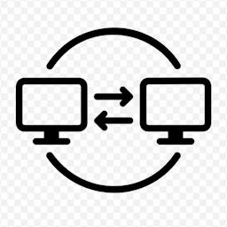

<p align="center">
  
</p>

# Crossover

Secure keyboard, mouse, and clipboard sharing between computers over an IP
network — two trusted machines beside one another should feel like one
larger workstation, without weakening the security boundary between them.

**Move. Type. Copy. Paste.**

> **Status: Phase 7 (Rich Clipboard) in progress — images work.** Two
> Windows machines pair with a typed one-time code, hold a mutually
> authenticated TLS 1.3 session with automatic reconnection, share one
> keyboard and mouse across a screen edge, run unattended as a background
> service, and synchronize the clipboard in both directions — **text and
> images**, the latter carried verbatim and validated over a multi-hour
> two-machine soak. Files and folders are designed
> ([ADR 0015](docs/adr/0015-spooled-virtual-file-paste.md)) and not yet
> built; macOS and Linux come later (Phase 9). The
> [roadmap](docs/ROADMAP.md) carries the authoritative current-phase marker.

## What it does

- One keyboard and mouse drives both computers; moving the pointer across a
  configured screen edge transfers control, like adjacent monitors
- Clipboard contents synchronize in both directions — text and images,
  images carried in the source clipboard's own format, byte for byte
- All traffic mutually authenticated and encrypted (TLS 1.3); explicit
  pairing with a typed one-time code; local-first — no cloud, no accounts,
  no external telemetry
- Runs unattended as a background service, reconnecting on its own

## What it does not do yet

- Files and folders on the clipboard — designed
  ([ADR 0015](docs/adr/0015-spooled-virtual-file-paste.md)), not built
- macOS and Linux — the platform boundary exists and the core compiles on
  all three, but only the Windows implementations are written (Phase 9)
- Arbitrary monitor arrangements — today a machine is declared `--left` or
  `--right` and its monitors are treated as one desktop; a drag-and-drop
  editor is Phase 8
- More than two machines, a tray application, discovery, or auto-update
  (Phase 10)
- Code-signed binaries, so SmartScreen will warn on first run

Target today: two Windows machines on a LAN. Implementation language: Rust.

## Building

```powershell
.\scripts\build.ps1
```

One command: runs the CI gate (format, lint, tests, dependency audit), builds
both executables, and writes every deliverable — portable archive, checksum,
Chocolatey package, and an `artifacts.json` manifest — into `dist\`. Use
`-SkipChecks` for a fast iteration build and `-SkipChocolatey` to stop at the
archive. Installing and packaging are covered in
[packaging/README.md](packaging/README.md).

Every binary knows exactly what it is:

```powershell
crossover version          # build version, channel, source commit, toolchain
crossover version --json   # the same, for scripts
crossover -V               # just the version string
```

A build that is not a tagged release says so — `0.1.0-dev.7.gabc1234.dirty`
names the commit it came from and admits to uncommitted edits.

## Documentation

| Document | Contents |
|----------|----------|
| [docs/SPECIFICATION.md](docs/SPECIFICATION.md) | What Crossover must do: requirements, priorities, scope |
| [docs/ARCHITECTURE.md](docs/ARCHITECTURE.md) | Workspace layout, platform abstraction, state machines |
| [docs/PROTOCOL.md](docs/PROTOCOL.md) | Wire protocol |
| [docs/SECURITY.md](docs/SECURITY.md) | Threat model and trust model |
| [docs/TESTING.md](docs/TESTING.md) | Testing strategy and Definition of Done |
| [docs/ROADMAP.md](docs/ROADMAP.md) | Development phases and exit criteria |
| [docs/adr/](docs/adr/README.md) | Architectural decision records |
| [docs/platform-risks-macos.md](docs/platform-risks-macos.md) | What a macOS port will fight, catalogued before it exists |
| [docs/platform-risks-linux.md](docs/platform-risks-linux.md) | The same for Linux, where the X11/Wayland split decides the shape |

Vulnerability reporting: [SECURITY.md](SECURITY.md).

## License

[MIT](LICENSE)
